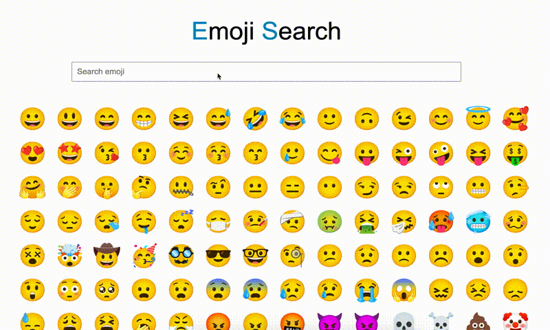

**Note: This project is still under development**

 

**Emoji Search Engine - Instant access to emoji** 
Instantly access your favorite emoji just by typing few letters. It uses fuzzy search algorithm on the keywords to get the most optimal emoji you want.

### DEMO
[priyankchheda.github.io/emoji-search/](https://priyankchheda.github.io/emoji-search/)

## Contribution
Feel Free to contribute. 
Please follow standard Guidelines.

### TODO
- skin tone selector
- mobile-friendly responsive site
- shift from vanilla javascript to react
